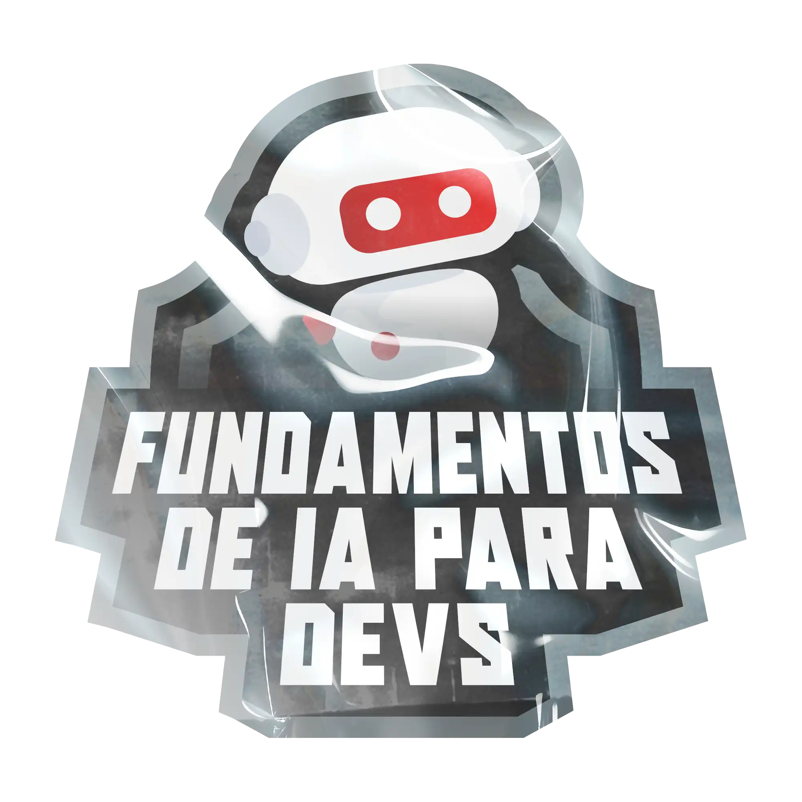

<h1 align="center"> FUNDAMENTOS DE IA PARA DEVS </h1>

 <a href="https://web.dio.me/" target="_blank">DIO</a>  |  <a href="https://app.santanderopenacademy.com" target="_blank">SANTANDER OPEN ACADEMY</a> 

<a href="#sobre">Sobre</a>&nbsp;&nbsp;&nbsp|&nbsp;&nbsp;&nbsp;
<a href="#tecnologia">Tecnologia</a>&nbsp;&nbsp;&nbsp|&nbsp;&nbsp;&nbsp;
<a href="#autor">Autor</a>.

# Sobre

 
Bem-vindo ao Postcast "Frontend - Patrulha CodeCanina", onde exploramos o poder e as possibilidades do ChatGPT, um modelo de linguagem avançado desenvolvido pela OpenAI. Este Postcast descobrindo frontend para crianças.

 

 

 

 

    01 - Figura Patrulha CodeCanina.
 

 
 

  

# Tecnologia

Esse projeto foi desenvolvindo com as seguintes tecnologias:

- IDE VisualStudio Code
- POWER POINT
- PDF
- Lexica.at
- IIElevenlabs

# Autor

_Daniela Velter_
 
 

